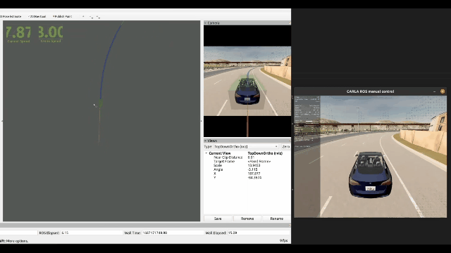

# Carla-Ros-Birdge-PNC

本项目旨在通过 carla-ros-bridge 在 carla 上实现自动驾驶常用规划与控制模块。

## [1、Controller Module](./controller)
本模块包含简易的控制算法

横向控制：`LQR`, `PurePuresuit`, `Stanley`

纵向控制：`PID`




## [2、Planning Module](./planning)

本模块包含简易场景下的路径规划算法

Global planner: `A*` (carla_ros_bridge 自带) 

Local planner: `Lattice Planner`


## 项目构建

本项目在 Ubuntu 20.04、ROS Noetic、carla 0.9.12 下通过测试。  
#### 1.安装依赖：

- [Carla simulator (0.9.12)](https://github.com/carla-simulator/carla/releases/tag/0.9.12)  

  安装配置手册：https://carla.readthedocs.io/en/0.9.12/start_quickstart/

  

- [ROS bridge for CARLA simulator(0.9.12)](https://github.com/carla-simulator/ros-bridge/tree/0.9.12)  

  安装配置手册：https://carla.readthedocs.io/projects/ros-bridge/en/latest/ros_installation_ros1/

  

- [Carla scenario_runner(0.9.12)](https://github.com/carla-simulator/scenario_runner) 

  安装配置手册：https://carla-scenariorunner.readthedocs.io/en/latest/getting_scenariorunner/


#### 2. 配置工作空间

**快速配置方式：**

```bash
cd scripts
./quickly_setup.sh
```

**手动配置方式：**

```
1.创建src文件，放置功能包源码：
  mkdir -p ~/catkin_ws/src

2.进入src文件夹
  cd ~/catkin_ws/src

3.将功能包复制到的src目录下

4.初始化文件夹
  catkin_init_workspace

5.编译工作空间
  catkin build
```


## Run Controller Demo

**终端1：启动carla**

```bash
cd path/to/carla/root

./CarlaUE4.sh
```

**终端2：启动控制结点**

```
source devel/setup.bash
```

Pure Pursuit

```
roslaunch controller controller_demo.launch control_method:="PurePursuit"
```

Stanley

```
roslaunch controller controller_demo.launch control_method:="Stanley"
```

LQR

```
roslaunch controller controller_demo.launch control_method:="LQR"
```


## Run Planning Demo

**终端1：启动carla**

```bash
cd path/to/carla/root

./CarlaUE4.sh
```


**终端2：启动Planning结点**

```bash
source devel/setup.bash

roslaunch planning planning_demo.launch
```


**终端3：启动scenario runner** 

scenario_runner-0.9.12目录下

```bash
python scenario_runner.py --scenario Avoid_and_Follow_1 --waitForEgo
```


**终端4：启动控制结点**

```bash
source devel/setup.bash

roslaunch controller controller.launch
```


## To-Do-List

- MPC的实现
- EM planner的实现
- local planner应用场景的泛化


## Reference

[Casper Auto](https://github.com/casper-auto)

[Optimal Trajectory Generation for Dynamic Street Scenarios in a Frenet Frame](https://www.researchgate.net/publication/224156269_Optimal_Trajectory_Generation_for_Dynamic_Street_Scenarios_in_a_Frenet_Frame)

[https://github.com/czjaixuexi/carla_ros_bridge_pnc](https://github.com/czjaixuexi/carla_ros_bridge_pnc)

