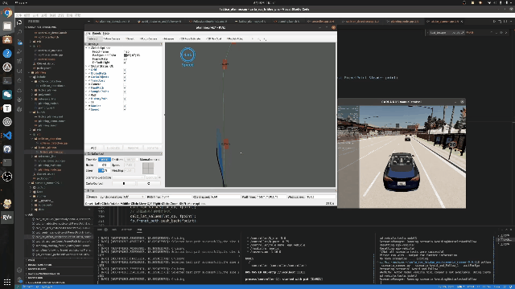

## Planning

简易场景下的路径规划

Global planner: A* (carla_ros_bridge 自带) 

Local planner: Lattice Planner

TO-DO: EM Planner

## Overview

#### 视频演示

<iframe src="//player.bilibili.com/player.html?aid=360071646&bvid=BV1PX4y1s7aa&cid=1170152532&page=1" width="500" height="500" scrolling="no" border="0" frameborder="no" framespacing="20" allowfullscreen="true"></iframe>

#### **Obstacle Avoidance:**




#### **Overtaking:**


#### **Following:**


## Run Planning Demo

**终端1：启动carla**

```bash
cd path/to/carla/root

./CarlaUE4.sh
```


**终端2：启动Planning结点**

```bash
source devel/setup.bash

roslaunch planning planning_demo.launch
```


**终端3：启动scenario runner** 

scenario_runner-0.9.11目录下

```bash
python scenario_runner.py --scenario Avoid_and_Follow_1 --waitForEgo
```


**终端4：启动控制结点**

```bash
source devel/setup.bash

roslaunch controller controller.launch
```


## Parameter Tuning

[lattice_planner.yaml](./config/lattice_planner.yaml)

```yaml
#Lattice Planner 路径采样相关参数
sample_max_time: 4.0 # 最大采样时间
sample_min_time: 2.5  #最小采样时间
sample_time_step: 0.5 # 采样时间step
sample_lat_width: 3.75 # 采样横向距离
sample_width_length: 0.25 #采样横向距离间隔

w_object: 0.1 # 纵向目标代价
w_lon_jerk: 0.01 # 纵向舒适代价
w_lat_offset: 40.0 # 横向偏离代价
w_lat_acc: 0.01 # 横向舒适代价
```


## ROS TOPIC

#### Subscribed topic

- `"/carla/" + role_name + "/odometry"`:获取车辆当前状态
- `"/carla/" + role_name + "/waypoints"`: 获取carla规划后的全局路径
- `"/cruise_speed"` : 获取巡航车速
- `"/carla/" + role_name + "/imu"` : 获取imu信息
- `"/carla/" + role_name + "/objects"` : 获取障碍物信息


#### Published topic

- `"/reference_line/local_waypoint"` : 发布给控制器的局部路径点信息
- `"/reference_line/ref_path"` : 参考线可视化
- `"/reference_line/sample_paths"` : 发布采样轨迹，用于rivz可视化
- `"/reference_line/final_path"`: 发布最优轨迹，用于rivz可视化
- `"/reference_line/history_paths"`: 发布历史参考路径，用于rivz可视化
- `"/speed_marker_text"`: 发布目标速度，用于rivz可视化


## Implementation-Details

### Referenceline

采用Spline曲线平滑参考线


### Lattice Planner

#### 路径采样方式

参考：[Optimal Trajectory Generation for Dynamic Street Scenarios in a Frenet Frame](https://www.researchgate.net/publication/224156269_Optimal_Trajectory_Generation_for_Dynamic_Street_Scenarios_in_a_Frenet_Frame)

横向轨迹采样：


纵向轨迹采样：


这里分了两种工况：

跟车轨迹：起始点s、v、a和末点的v、a，用四次多项式连接

巡航轨迹：起始点s、v、a和末点的s、v、a，用五次多项式连接


#### 代价函数设计

参考了Apollo中的Lattice Planner代价函数(代码中有一定简化)

- 纵向，到达设定速度、行驶距离：

  

- 纵向，平滑： 

  

- 纵向，避免碰撞： 


- 横向，偏移： 

​		


- 横向，舒适性：


#### 轨迹验证

• 碰撞检测

• 速度阈值检测

• 加速度阈值检测

• 曲线行驶曲率检测

